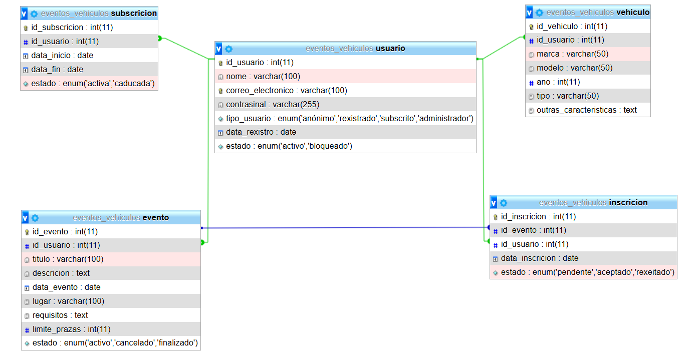

# FASE DE DESEÑO

- [FASE DE DESEÑO](#fase-de-deseño)
  - [1- Diagrama da arquitectura](#1--diagrama-da-arquitectura)
  - [2- Casos de uso](#2--casos-de-uso)
  - [3- Diagrama de Base de Datos](#3--diagrama-de-base-de-datos)
  - [4- Deseño de interface de usuarios](#4--deseño-de-interface-de-usuarios)

> *EXPLICACIÓN:* Este documento inclúe os diferentes diagramas, esquemas e deseños que axuden a describir mellor o [nome do proxecto] detallando os seus compoñentes, funcionalidades, bases de datos e interface.

## 1- Diagrama da arquitectura

.png)

## 2- Casos de uso
> 

## 3- Diagrama de Base de Datos

>### Modelo Entidade / Relación
> 
> 
> ### Modelo Relacional
> **USUARIO**
> Usuario(DNI, nome, correo_electronico, contrasinal, tipo_usuario, data_rexistro, estado)
> PK: DNI
> 
> **VEHICULO**
> Vehiculo(id_vehiculo, id_usuario, marca, modelo, ano, tipo, outras_caracteristicas)
> PK: id_vehiculo
> FK: id_usuario → usuario(id_usuario)
> Relación: cada vehículo pertence a un usuario (0,N)
> 
> **EVENTO**
> Evento(id_evento, id_usuario, titulo, descricion, data_evento, lugar, requisitos, limite_prazas, estado)
> PK: id_evento
> FK: id_usuario → usuario(id_usuario)
> Relación: un evento é creado por un usuario (1), se ten subscrición activa
> 
> **INSCRICION**
> Inscricion(id_inscricion, id_evento, id_usuario, data_inscricion, estado)
> PK: id_inscricion
> FK1: id_evento → evento(id_evento)
> FK2: id_usuario → usuario(id_usuario)
> 
> Relacións:
> Un usuario pode estar inscrito en varios eventos
> Un evento pode ter múltiples Inscricións
> 
> **SUBSCRICION**
> Subscricion(id_subscricion, id_usuario, data_inicio, data_fin, estado)
> PK: id_subscricion
> FK: id_usuario → usuario(id_usuario)
> *só se permite unha subscrición activa por usuario*
> 
> **Relacións chave resumidas**
> Usuario — Vehiculo: 1:N
> Usuario — Evento (creador): 1:N
> Usuario — Inscricion — Evento: N:M (resolto mediante a táboa Inscricion)
> Usuario — Subscricion: 1:N (pero con restrición de 1 activa)

## 4- Deseño de interface de usuarios
https://www.figma.com/design/ETQpwC0st35CET4WkJX7RR/MotorGal?node-id=0-1&t=ljElCbqlkGAsPIGC-1
>
[**<-Anterior**](../../README.md)
